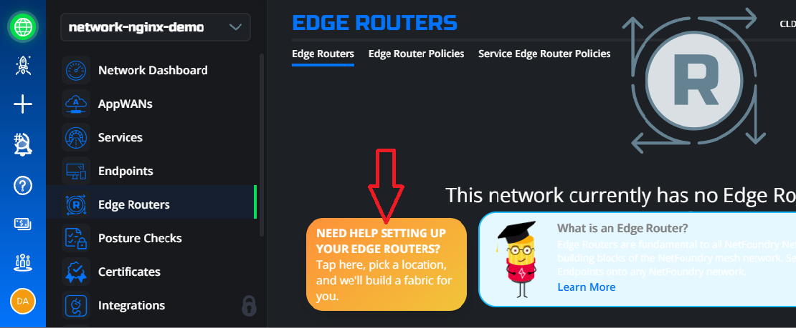

# Nginx Module Solution
## _The way to secure the Azure AKS API Service with [OpenZiti](https://github.com/openziti)_ and NGINX

[](https://github.com/openziti)


## Meal Prep Time!

Here are all the ingredients you'll need to cook this meal.

- Cook Time: 1 hour
- Ingredients
  - This Repo!
  - Azure Subscription, Resource Group and CLI Access
  - [OpenZiti Nginx Module Repo](https://github.com/openziti/ngx_ziti_module)
  - [OpenZiti Zitified Kubeztl Repo](https://github.com/dariuszSki/kubeztl)
  - [Go installed on the client](https://go.dev/doc/install) - v1.19 or later
  - NetFoundry Teams Account (Free Tier!)
---
## Architecture:


## Zero Trust Access Level:
---


---
## Prep Your Kitchen
In order to do this demo, you will need an Azure account and permissions to create resources in that account via ARM Templates. You will also need a version of [Azure Cli](https://learn.microsoft.com/en-us/cli/azure/install-azure-cli). You will need [Go installed](https://go.dev/doc/install) as well. We suggest the latest versions.
Let's run quick commands to ensure we have everything we need installed:
```
> az version
{
  "azure-cli": "2.43.0",
  "azure-cli-core": "2.43.0",
  "azure-cli-telemetry": "1.0.8",
  "extensions": {}
}

> go version
go version go1.19.1 windows/amd64
```

Once you're sure you have proper permissions in Azure and you have a compatible version of Azure Cli and Go, go ahead and clone this repo.

---

## Create a NetFoundry Teams (Free Tier) Account
In order to start this recipe, you'll need to create a Teams account at [NetFoundry Teams](https://netfoundry.io/pricing/)

---

## Create a NetFoundry Network

All you need is `name=network-nginx-demo` and region to deploy a network.


Once the network is up (i.e. network controller only), navigate to the edge router page and click on the help message at the bottom of the page. Enter an address that matches the region you provided in the previous step and the fabric, i.e. 2 Public Edge Routers, will be deployed for you along with the Edge Router Policy.



---

## Create Server and Client Endpoints

To create endpoints, navigate to `Endpoints` in the navigation pannel to the left and click '+' to create a new endpoint. Let's name the client application `client-nginx` and assign `Attribute`: `#clients`. Repeat this step for the server module application `server-nginx` and `Attribute`: `#servers`. Download the identity jwt token files to `files/identity_tokens` folder. You will need to upload the server token up to the nginx server in the next step.

***Note: It is more secure if one-time tokens are moved around than the enrolled identity configuration files, which contain private keys. This means that the enrollment of these identities will happen on the destination clients/servers.***

---

## Deploy Your Nginx Server and AKS Cluster

Now that we have the enrollment tokens for Nginx Module and Client Go Apps, we can go ahead and deploy the infrustructure in Azure using the ARM Templates. The templates included in this project will create the following resources (and their associated resources):

- Virtual Network
- AKS Private Cluster with Azure CNI
- Container Registry
- Nginx Server
- Security Group with only SSH port open to Internet

You will need to set a few environmental variables. Deploy infrastructure by running the following commands:
```bash
Linux Client

export LOCATION='eastus' # preferably one that does not have any infrastructure
export SUB_ID='xxxxxxxx-xxxx-xxxx-xxxx-xxxxxxxxxxxx'
export RG_NAME='resource group name' # preferably a new one for easy clean up after demo
export SSH_PKEY='ssh public key'

Windows Client

$env:LOCATION = 'eastus'
$env:SUB_ID = 'xxxxxxxx-xxxx-xxxx-xxxx-xxxxxxxxxxxx'
$env:RG_NAME = 'resource group name'
$env:SSH_PKEY = 'ssh public key'

az login --use-device-code # using web browser if you don't have service principal access set up
az login --service-principal -u $APP_ID -p $CLIENT_SECRET --tenant $TENANT_ID

git clone https://github.com/netfoundry/ziti-cookbook.git; cd ziti-cookbook/NginxModuleSolution/

az deployment group create --name daksdeploy$LOCATION --subscription $SUB_ID --resource-group $RG_NAME --template-file files/azure/template.json --parameters files/azure/parameters.json -p location=$LOCATION acrResourceGroup=$RG_NAME adminPublicKey="$SSH_PKEY"
```
Wait for resources to be deployed successfully... Once completed, grab the AKS API FQDN and Nginx Server IP under "outputs" in the generated response as shown in the example below.

```bash
"outputs": {
      "aksApiFQDN": {
        "type": "String",
        "value": "akssand-2887a9f2.eb3aa8fb-333a-47c3-b657-61035c4c4f98.privatelink.eastus.azmk8s.io"
      },
      "nginxName1": {
        "type": "String",
        "value": "4.227.217.18"
      }
    },
```

---

## Build and Deploy Nginx Ziti Module
`````bash
# Upload `nginx-server.jwt` file to the nginx server.
scp -i "ssh private key" files/identity_tokens/server-nginx.jwt ziggy@<nginx_server_public_ip>:

# Login to Nginx Server host using ssh.
ssh -i "ssh private key" ziggy@<nginx_server_public_ip>

# Update all existing and add essentials packages for the build process
sudo apt update && sudo apt upgrade -y 
sudo apt install libpcre3-dev libz-dev libuv1-dev cmake build-essential jq -y
# May need to click ok on messages, leave defaults on
sudo reboot

#Build the module
git clone https://github.com/openziti/ngx_ziti_module.git; cd ngx_ziti_module/; mkdir cmake-build; cd cmake-build
cmake ../
make

#Relocate the module to the Nginx's modules folder
sudo cp ngx_ziti_module.so /etc/nginx/modules/

# Enable the ziti module in the configuration file. Just replace the existing content with the following data. Dont forget to replace the fqdn with your own.
# Note: The identity path points to the nginx directory. You will move the identiy file there after it is enrolled.
sudo tee /etc/nginx/nginx.conf << EOF
load_module modules/ngx_ziti_module.so;

user  nginx;
worker_processes  auto;

error_log  /var/log/nginx/error.log debug;

thread_pool ngx_ziti_tp threads=32 max_queue=65536;

events {
    worker_connections  1024;
}

ziti identity1 {
    identity_file /etc/nginx/server-nginx.json;

    bind nginx-service-01 {
        upstream akssand-2887a9f2.eb3aa8fb-333a-47c3-b657-61035c4c4f98.privatelink.eastus.azmk8s.io:443;
    }
}
EOF
`````

---

## Enroll Nginx Module Identity

`````bash
cd ~
# Install Ziti Cli first.
wget $(curl -s https://api.github.com/repos/openziti/ziti/releases/latest | jq -r .assets[].browser_download_url | grep "linux-amd64")
tar -xf $(curl -s https://api.github.com/repos/openziti/ziti/releases/latest | jq -r .assets[].name | grep "linux-amd64") 'ziti/ziti' --strip-components 1; rm $(curl -s https://api.github.com/repos/openziti/ziti/releases/latest | jq -r .assets[].name | grep "linux-amd64")
  
# Enroll Server Identity
sudo ./ziti edge enroll -j server-nginx.jwt -o /etc/nginx/server-nginx.json

# Restart the Nginx process.
sudo systemctl restart nginx.service

# Check if Ziti Identity intialized successfully
cat /var/log/nginx/error.log
...
...
2022/12/28 21:28:59 [debug] 16347#16347: enter: ngx_ziti_init_process
2022/12/28 21:28:59 [warn] 16347#16347: initializing block identity1
(16347)[        0.000]    INFO ziti_log_set_level set log level: root=1

`````

---

## Build Client Kubeztl App

`````powershell
# Clone Kubectl Repo on your client
git clone https://github.com/dariuszSki/kubeztl.git; cd kubeztl;
mkdir build
go build -o build ./...

# Test Client app - kubeztl
build/kubeztl version -o json 
# Response with no service name provided                                                                    
ERROR   Service Name not provided
# Response with no identity configuration file provided 
build/kubeztl get nodes --zConfig= --service=nginx-service-01
ERROR   Loading Ziti Identity Config File
`````
If you get the error as shown above, then the client app was built successfully.

---

## Enroll Client App Identity

***Note: If your are using a linux client, you can follow the same commands as described for the nginx module above in [the previous step](#enroll-nginx-module-identity).***

`````powershell
# Install Ziti Cli on Windows using powershell
wget $($(Invoke-RestMethod -uri https://api.github.com/repos/openziti/ziti/releases/latest).assets |  where-object { $_.name -match "windows"}).browser_download_url -UseBasicParsing -OutFile $($(Invoke-RestMethod -uri https://api.github.com/repos/openziti/ziti/releases/latest).assets |  where-object { $_.name -match "windows"}).name

Expand-Archive -LiteralPath $($(Invoke-RestMethod -uri https://api.github.com/repos/openziti/ziti/releases/latest).assets |  where-object { $_.name -match "windows"}).name -DestinationPath ./; Move-Item -Path ziti/ziti.exe -Destination ./; Remove-Item -Path ziti/ -Recurse -Force

rm $($(Invoke-RestMethod -uri https://api.github.com/repos/openziti/ziti/releases/latest).assets |  where-object { $_.name -match "windows"}).name

# Enroll Client Identity 
./ziti edge enroll -j files/identity_tokens/client-nginx.jwt -o files/identity_tokens/client-nginx.json
`````

---

## Creating a Service

In order for your Nginx Module to be recognized on the fabric, it must be hosted as a [Service](#service).

For this, we'll create a Simple Service. On the nfconsole.io dashboard, select Services and the + on the top right. Then select `Simple Service` and Create Service. We'll name the service `nginx-service-01` and give it the service attribute `nginx-services` and leave the edge router attributes as default.

This service will be hosted on the sdk embedded endpoint, i.e nginx module. Thus, intercept host information is irrelevent in our case, but it needs to be filled in the current UI version. Use `name=none.io, port 1` and enter `#servers` group tag in the hosted endpoints field. Select `Yes` to choose Native Application SDK Based Option.


---

## Adding Endpoints to an AppWAN

As mentioned before, in order to allow our local Endpoint `(kubeztl)` to access our hosted Endpoint `(nginx module)`, we'll need to assign them to the same [AppWAN](#appwan). Under AppWANs on our nfconsole.io dashboard, click the plus sign to create a new AppWAN. Let's name it `nginx-appwan` with our service attribute `nginx-services` and endpoint attributes `clients`.


## It's Alive!!

Everything should be connected as expected now. Let's look again to ensure everything is as expected.

Now the event history should look as follows: 


---

## Let's test our service

We will use our zitified kubectl client to interact with the AKS API Controll Plane to list, create, delete context, containers, etc.

`````powershell
# Configure your local kube configuration file using azure cli
az login # if not already logged in
# Windows
$env:RG_NAME = 'resource group name'
$env:SUB_ID =  'xxxxxxxx-xxxx-xxxx-xxxx-xxxxxxxxxxxx'
az aks get-credentials --resource-group $env:RG_NAME --name {myAKSCluster} --subscription $env:SUB_ID
# Linux
$RG_NAME = 'resource group name'
$SUB_ID =  'xxxxxxxx-xxxx-xxxx-xxxx-xxxxxxxxxxxx'
az aks get-credentials --resource-group $RG_NAME --name {myAKSCluster} --subscription $SUB_ID

# Change directory to kubeztl and check the installed context in the kubectl config file
cd kubeztl
build/kubeztl config  get-contexts
CURRENT   NAME            CLUSTER         AUTHINFO                                      NAMESPACE
*         akssandeastus   akssandeastus   clusterUser_<$RG_NAME>_akssandeastus
# Let's check the status of nodes in the cluster. One should be expected!
build/kubeztl get nodes
ERROR   Service Name not provided # if we dont provide ziti service name and identity configuration file path

build/kubeztl get nodes --zConfig ../client-nginx.json --service nginx-service-01
NAME                                STATUS   ROLES   AGE    VERSION
aks-agentpool-26146717-vmss000000   Ready    agent   153m   v1.23.12

build/kubeztl cluster-info --zConfig ../client-nginx.json --service nginx-service-01
Kubernetes control plane is running at https://akssand-2887a9f2.eb3aa8fb-333a-47c3-b657-61035c4c4f98.privatelink.eastus.azmk8s.io:443
addon-http-application-routing-nginx-ingress is running at http://20.246.189.101:80 http://20.246.189.101:443
CoreDNS is running at https://akssand-2887a9f2.eb3aa8fb-333a-47c3-b657-61035c4c4f98.privatelink.eastus.azmk8s.io:443/api/v1/namespaces/kube-system/services/kube-dns:dns/proxy
Metrics-server is running at https://akssand-2887a9f2.eb3aa8fb-333a-47c3-b657-61035c4c4f98.privatelink.eastus.azmk8s.io:443/api/v1/namespaces/kube-system/services/https:metrics-server:/proxy
`````
***Dark Access enabled !!!***

## Another test if you are up for it!
To acces this app once deployed, you can follow [the sidecar receipe](../SimpleSidecarSolution/README.md)

`````bash
# Deploying Helloworld App.

build/kubeztl  --zConfig ../client-nginx.json --service nginx-service-01 apply -f ..\ziti-cookbook\NginxModuleSolution\files\templates\helloworld.yaml
deployment.apps/helloworld created

build/kubeztl  get pods --zConfig ../client-nginx.json --service nginx-service-01
NAME                         READY   STATUS    RESTARTS   AGE
helloworld-ff5c98fbf-xq5w2   1/1     Running   0          2m11s

build/kubeztl  --zConfig ../client-nginx.json --service nginx-service-01 get pods -o wide
NAME                         READY   STATUS    RESTARTS   AGE     IP           NODE                                NOMINATED NODE   READINESS GATES
helloworld-ff5c98fbf-xq5w2   1/1     Running   0          4m36s   10.17.1.16   aks-agentpool-26146717-vmss000000   <none>           <none>

# Deleting Helloworld App
build/kubeztl  delete deployment helloworld --zConfig ../client-nginx.json --service nginx-service-01
deployment.apps "helloworld" deleted

build/kubeztl  --zConfig ../client-nginx.json --service nginx-service-01 get pods -o wide
No resources found in default namespace.
`````

---

## NetFoundry Terminology
### Endpoint

Endpoints are light-weight agents that are installed on your devices or in an APP as a SDK. Endpoints are enrolled to the NetFoundry network using the registration process via one-time use secure JWT. 

See more [here](https://support.netfoundry.io/hc/en-us/sections/360002445391-Endpoints) to learn more about endpoints in NetFoundry and how to create & install endpoints. 

### Identity

Attributes are applied to Endpoints, Services, and Edge Routers. These are tags that are used for identifying a group or a single endpoint / service / edge router. Attributes are used while creating APPWANs. The @ symbol is used to tag Individual endpoints / services / edge routers and # symbol is used to tag a group of endpoints / services / edge routers.

[Learn more](https://support.netfoundry.io/hc/en-us/articles/360045933651-Role-Attributes) on how attributes simplify policy management in NetFoundry.

### Controller

The Controller is the central function of the network. The controller provides the control plane for the software defined network for management and configurations. It is responsible for configuring services, policies as well as being the central point for managing the identities used by users, devices and the nodes making up the Network. Lastly but critically, the Controller is responsible for authentication and authorization for every connection in the network.

### Edge Router

NetFoundry Hosted Router –

NetFoundry fabric is a dynamic mesh of hosted edge routers that are enabled to receive traffic.  The fabric is dedicated per network and carries traffic only within the network. NF fabric provides the best path for traffic to reach the destination node from the source node. [This document](https://support.netfoundry.io/hc/en-us/articles/4410429194125-NetFoundry-Smart-Routing) covers details about NF's smart routing, how edge routers make routing decisions and how the best path is selected. A min of 1 hosted edge router is required and two or more routers are suggested to create a fabric.

Customer Edge Router –

Customer edge routers are spun up by customers at their private data center / public clouds / branch locations in their LAN. The role of an edge router is to act as a gateway to NetFoundry network to send / receive packets between the apps  and a NetFoundry Network. Edge routers can either host services or act as a WAN gateway to access services in an APPWAN.

See more [here](https://support.netfoundry.io/hc/en-us/articles/360044956032-Create-and-Manage-Edge-Routers) to learn more about edge routers in NetFoundry and how to create & install edge routers.

### Attribute

Attributes in NetFoundry provide a user-friendly approach for grouping endpoints, services, and policies in configuring networks.

See more [here](https://support.netfoundry.io/hc/en-us/articles/360045933651-Role-Attributes) and check out the [Attribute Explorer](https://support.netfoundry.io/hc/en-us/articles/360027780971-Introduction-to-the-Network-Dashboard#h_01G4VQZ22VMTC1PY6FYM2S250D)


### AppWAN

AppWans are like a policy that defines which endpoints can access which services. AppWANs are micro perimeters within your network. Each network can have many APPWANs. AppWANs are a combination of services & endpoints that have to access the services.

See more [here](https://support.netfoundry.io/hc/en-us/sections/360002806392-AppWANs-Services) on how to create and manage APPWANs.

### Service

Services define resources on your local network that you want to make available over your NetFoundry network. Once you've created a service, add it to one or more AppWANs to make it available to those AppWAN members. Think of a service as a rule in a firewall whitelist, which defines the exact set of network resources that one may access over an AppWAN, while all other traffic is blocked.

See more [here](https://support.netfoundry.io/hc/en-us/articles/360045503311-Create-and-Manage-Services) on how to create services.


### NetFoundry Teams (Free Tier)

NetFoundry has created a Teams tier that is free up to 10 nodes. All examples that include this in their ingredients can be done with less than 10 nodes and can be done for free!
