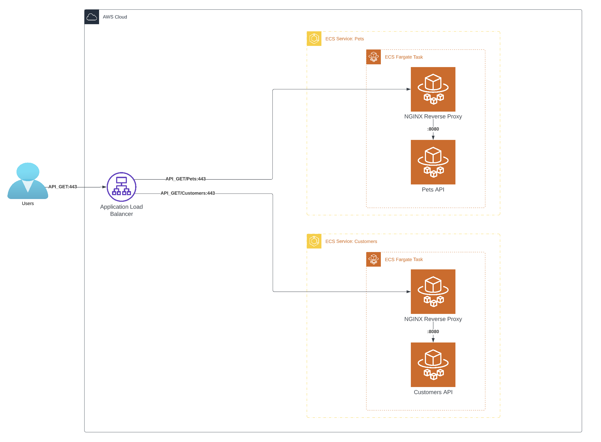
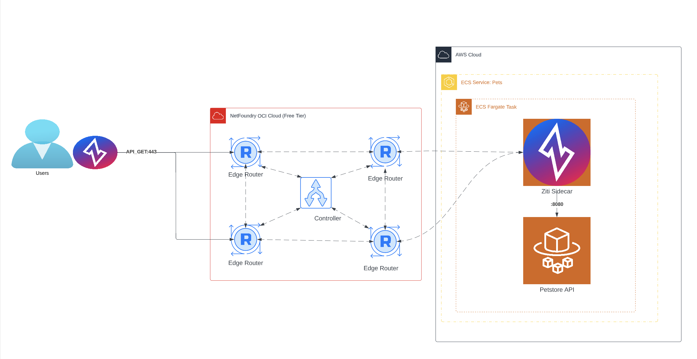

# Ziti Cookbook
## _Recipes to make Ziti fit your palete_

The Ziti Cookbook is a recipe book full of examples of DevOps use cases for NetFoundry and OpenZiti and pre-baked solutions to those use cases. This Ziti Cookbook will leverage industry standard technologies that are implemented in a way that can fit many use cases.

Try out one of our sample recipes today!

## Recipes

Check out one of our recipes now if you know what you want to make, or continue reading to see use cases for each!

| Recipe | Technologies |
| ------ | ----- |
| [SimpleSidecarSolution](SimpleSidecarSolution/README.md)| AWS Fargate, Netfoundy, Terraform |
| [BYOCertificateAuthority](BYOCertificateAuthority/README.md)| AWS Fargate, AWS Private CA, Netfoundy, Terraform |
| ------ | ----- |

## What is OpenZiti?
The OpenZiti project is a free, open source project focused on bringing Zero Trust to any application. The project provides all the pieces required to implement or integrate Zero Trust into your solutions:

- The overlay network
- Tunneling Applications for all operating systems
- Numerous SDKs making it easy to add Zero Trust concepts directly into your application

Ziti makes it easy to embed Zero Trust, programmable networking directly into your app. With Ziti you can have Zero Trust, high performance networking on any Internet connection, without VPNs!

## What is NetFoundry?
Zero trust networking for 100s of millions of sessions per year. Managed SaaS, built on OpenZiti, including hosted global network fabric.

OpenZiti is an amazing solution for Zero Trust Networking. It allows DevOps/Software Engineers to put any and all of their architecture behind zero ingress firewalls and explicitly determine access. It treats networking permissions like AWS IAM treats user permissions with a concept called AppWANs. 

## SimpleSidecarSolution
The most common use case we've found for Zero Trust is _"How do I easily secure my Dockerized APIs so that I can control access with a DENY ALL policy in AWS?"_ This is a perfect use case for OpenZiti! Let's learn how to cook it!

- Cook Time: 1 hour
- Ingredients
-- AWS Account
-- Terraform >=1.0
-- Your Dockerized API (sample flask API included)
-- NetFoundry Teams Account (Free Tier, walkthrough included)

For this recipe, we've decided to use NetFoundry's Free Teams offering. This same solution can be done entirley Open Source and on any cloud provider. But with AWS's Fargate offering and NetFoundry's Teams offering, it can all be done in less than an hour. 

Common redis architecture within AWS:

SimpleSidecarSolution:

[This is what I needed! Let's start cooking with Ziti!](SimpleSidecarSolution/README.md)

## NetFoundry Teams (Free Tier)

NetFoundry has created a Teams tier that is free up to 10 nodes. All examples that include this in their ingredients can be done with less than 10 nodes and can be done for free!
