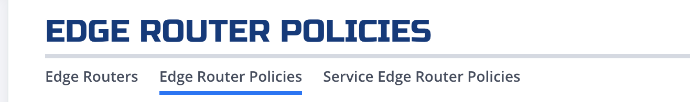
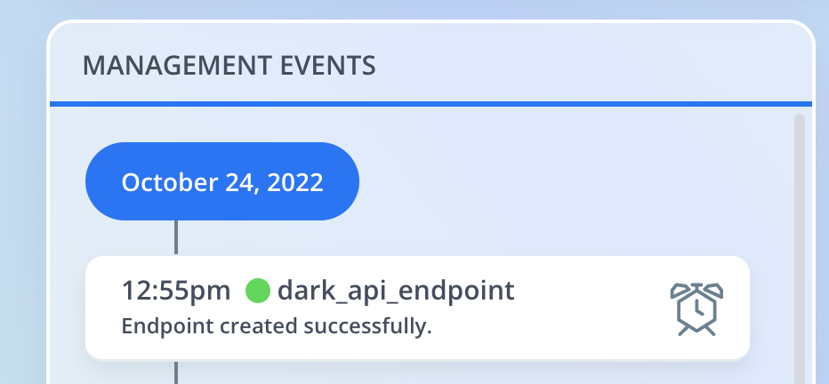
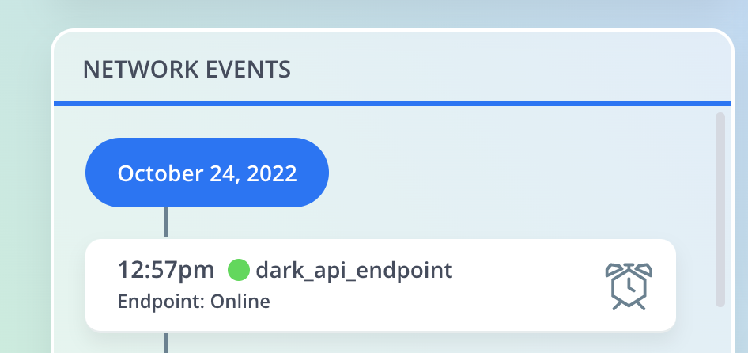
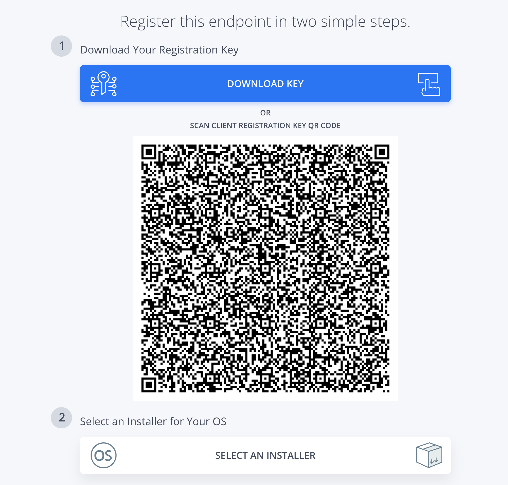
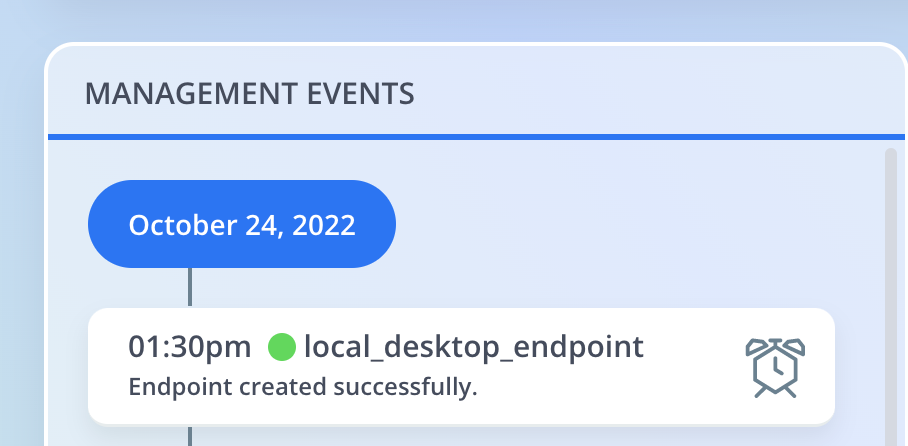
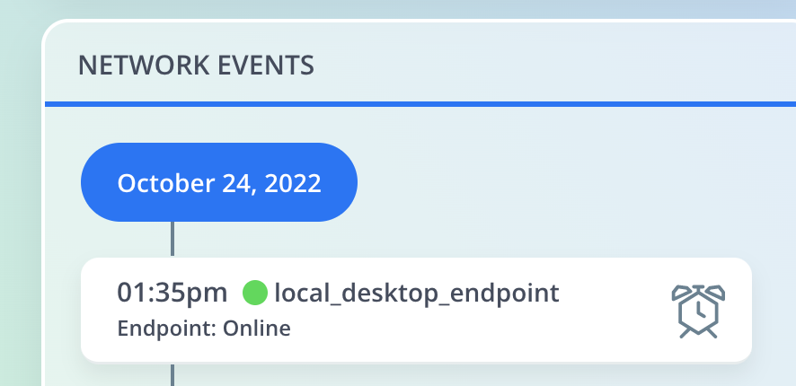
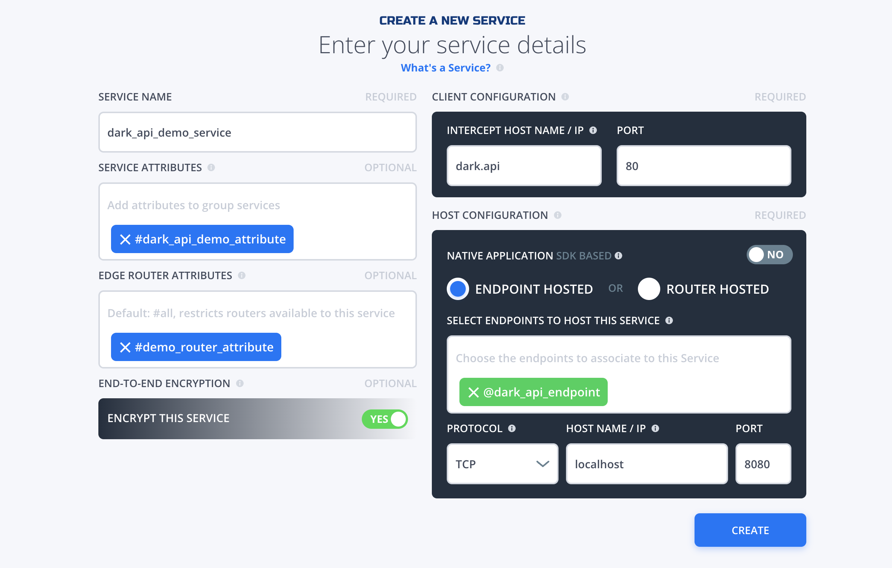
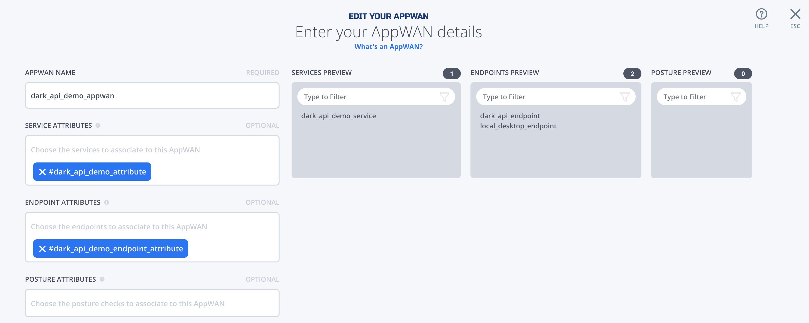
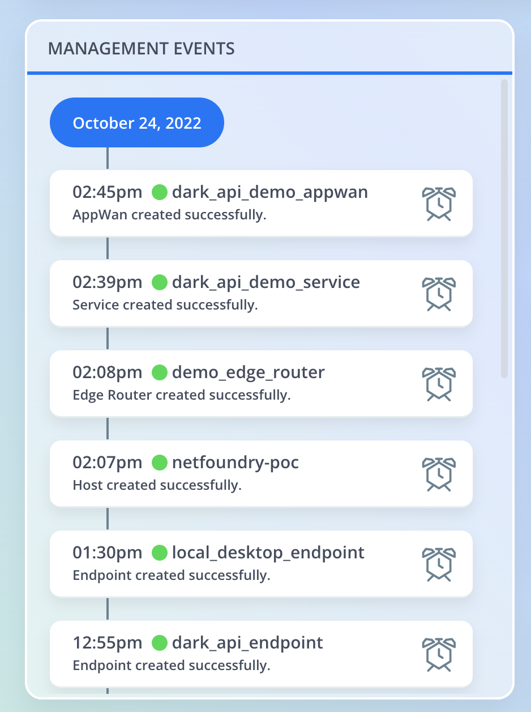
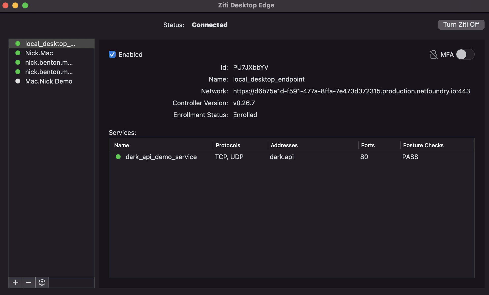

# Simple Sidecar Solution
## _The fastest way to secure your API with OpenZiti_

[](https://github.com/openziti)


## Meal Prep Time!

Here are all the ingredients you'll need to cook this meal. And don't worry, we'll explain the last 2. They're free!

- Cook Time: 1 hour
- Ingredients
  - This Repo!
  - AWS Account and CLI Access
  - Terraform >=1.0.1
  - GNU Make
  - Any Dockerized API (sample flask API included)
  - NetFoundry Teams Account (Free Tier!)
  - Ziti Desktop Edge 
---
## Prep Your Kitchen
In order to do this demo, you will need an AWS account and permissions to create resources in that account via Terraform. You will also need a version of Terraform >=1.0.1. We suggest the latest version, as of the time of this tutorial we are using 1.3.2 https://www.terraform.io/downloads. You'll also need to ensure you have Make.

Let's run 3 quick commands to ensure we have everything we need installed:
```
> aws --version
aws-cli/2.7.31 Python/3.10.6 Darwin/21.6.0 source/x86_64 prompt/off
> aws sts get-caller-identity
{
    "UserId": "AIDAXXXXXXXXXXXX",
    "Account": "012345678910",
    "Arn": "arn:aws:iam::012345678910:user/ziti.chef"
}

> Terraform --version
Terraform v1.3.2

> make --version
GNU Make 3.81
```
If you're sure you have **make** installed, you can simply run ```make versions``` to ensure you have what you need.

Once you're sure you have proper permissions in AWS and you have a compatible version of Terraform and Make installed, go ahead and clone this repo.

You will also need a "Hello World" API that can be deployed to AWS Fargate. We suggest that you start with the default image included in [variable.tf](terraform/variables.tf), but once that's working, feel free to replace it with whatever flavor of API you like!

---

## Create a NetFoundry Teams (Free Tier) Account
In order to start this recipe, you'll need to create a Teams account at [NetFoundry Teams](https://netfoundry.io/pricing/)

---

## Create a NetFoundry Hosted Edge Router

In order to create our Zero Trust Fabric, two major components are required. At least one [Edge Router](###EdgeRouters) and a [Controller](###Controller). For simplicity of this demo, we'll just create a NetFoundry hosted Edge Router.

On your NetFoundry Console, select Edge Routers, click the + button on the top right. We'll select NetFoundry Hosted and whichever the closest location to our endpoints is. Traffic is smart routed across Edge Routers. So if you're located geographically distant from the API (i.e deployed in us-east-1 and you live in APAC), you may want to create multiple Edge Routers and test out the speed benefits. For now, we'll assume our local machine is in US EST, and our API will be deployed in us-east-1. Both AWS us-east-1 and OCI **us-ashburn-1** are located in Virginia. So we'll use that. We'll name this router **demo_edge_router** and add the attribute **dark_api_demo_router_attribute**


Additionally, we'll need to create an Edge Router Policy. Under Edge Routers, you'll see Edge Router Policies at the top:


We'll name this policy "dark_api_demo_router_policy" and add the "#dark_api_demo_router_attribute" and the endpoint attribute "dark_api_demo_endpoint_attribute". This should show both expected Endpoints in the preview.


## Create Your First Identity

Once you've created an account at NetFoundry.io, you'll need to create a [Ziti Endpoint](###Endpoints). To do this, navigate to **Endpoints** in the navigation pannel to the left and click '+' to create a new endpoint. Let's name this endpoint "dark_api_endpoint" and assign it the [Attribute](###Attributes) "dark_api_demo_endpoint_attribute" (New Attribute). This will be the [Ziti Identity](###Identities) for the API you deploy to AWS during this recipe. Select **DOWNLOAD KEY** and save the one-time use JWT token to the folder **identity_token_goes_here**

---

## Enroll dark_api_endpoint

In order for **Endpoint** to be enrolled into your OpenZiti fabric, you will need to enroll the .jwt token. This will return a .json token that contains mTLS certs that we will store as a secret in **AWS Secrets Manager** and will be enrolled to the fabric [Controller](###Controller).

To enroll your dark_api_endpoint.jwt and get dark_api_endpoint.json as a return, run ```make enroll```. Now you should have ./identity_token_goes_here/dark_api_endpoint.json. If this JSON object is correctly generated, you've enrolled your **Endpoint** correctly (see image below)! Next we'll run the Terraform and place that secret in **AWS Secrets Manager** ```make tf```. This secret should already be included in the .gitignore, but now would be a good time to double check that you are not committing these certificates to your repository. In fact, once they are stored as a secret in AWS and encrypted with KMS, it is best practice to delete the JSON object locally ```make clean```. If you'd like to run all of these steps in one clean command, simply run ```make``` and it will chain all three of these commands along with the ```make versions``` command mentioned earlier to enroll your token with the controller, deploy the secret to AWS, deploy a new task with the new secret, and remove the secret from your file system.

-----

## Check Our Progress!

Now that you've enrolled your [Ziti Endpoint](###Endpoints) and spun up a Fargate Task to run a sidecar in front of an API, we should be able to see a few indicators of success. First, let's look at your Network Dashboard for nfconsole.io. Here we should see that the **dark_api_endpoint** has been created and is online!



This shows that we have successfully enrolled the Endpoint with the Controller (```make enroll```). If you just ran ```make```, you will not see the json object locally but will see it created successfully here.


This shows that we have successfully spun up an Endpoint that is enrolled with the Controller.

---

## What Makes This API "Dark"?

In the infrastructure you have deployed via Terraform, you will see that the Security Group in front of the ECS Service has no ingress allowed. This protects us from attacks like SCaN. In order to access a Dark API, you will need to have both Endpoints (user and API) explicitly allowed via [AppWAN](***APPWans). Then, you will need the connecting Endpoint (in this case your laptop) to be on the same Ziti Fabric. We will accomplish this by using the Ziti Desktop Edge.

## Creating Local Endpoint With ZDE

In order to access the dark_api_endpoint, we'll need to create a local_desktop_endpoint and give it the same attribute as the dark_api_endpoint (#dark_api_demo_endpoint_attribute). Once you have created the new Endpoint, download the key and in step 2 of the registration screen, install the correct ZDE for your OS.


Now you'll want to add the new Identity that you've downloaded. On the Mac client, it will look like this. Click the + on the bottom left and select local_desktop_endpoint.jwt and click "Enroll". This will enroll your local machine with the Controller just as we've done previously with your Ziti Sidecar. Just as before, if you check your Network Dashboard on nfconsole.io, you should see your local_desktop_endpoint created and online.



---

## Creating a Service

In order for your Ziti Sidecar and Dark API to be recognized on the fabric, we must register it as a [Service](### Services).

For this, we'll create a Simple Service. On the nfconsole.io dashboard, select Services and the + on the top right. Then select Simple Service and Create Service. We'll name the service "dark_api_demo_service" and give it the service attribute "dark_api_demo_attribute" and router attribute "demo_router_attribute".

This service is configuring the traffic for the associated endpoint. So we'll create a new address for our sidecar as "dark.api" and route traffic to it via port 80. Then we'll tell it to forward traffic to "localhost" on port 8080. This will send all traffic our local machine sends to dark.api:80 via our ZDE to our dark API on localhost:8080.



---

## Adding Endpoints to an AppWAN

As mentioned before, in order to allow our local Endpoint (ZDE) to access our deployed Endpoint (sidecar and dark API), we'll need to assign them to the same [AppWAN](###AppWANs). Under AppWANs on our nfconsole.io dashboard, click the plus sign to create a new AppWAN. Let's name it "dark_api_demo_appwan" with our service attribute "dark_api_demo_attribute" and we're looking to connect our "local_desktop_endpoint" to our "dark_api_demo_service". We can either explicitly add both of those under **Endpoint Attributes** or add the attribute we've created as "dark_api_demo_endpoint_attribute". This should add both the service and endpoint to the preview on the right.




## It's Alive!!

Everything should be connected as expected now. Let's look again to ensure everything is as expected.

Now our event history should look as follows (ignore netfoundry-poc): 



And our ZDE should show the expected connection:



Now let's try and connect to our API! 

## NetFoundry Terminology
### Endpoints

Endpoints are light-weight agents that are installed on your devices or in an APP as a SDK. Endpoints are enrolled to the NetFoundry network using the registration process via one-time use secure JWT. 

See more [here](https://support.netfoundry.io/hc/en-us/sections/360002445391-Endpoints) to learn more about endpoints in NetFoundry and how to create & install endpoints. 

### Identities

Attributes are applied to Endpoints, Services, and Edge Routers. These are tags that are used for identifying a group or a single endpoint / service / edge router. Attributes are used while creating APPWANs. The @ symbol is used to tag Individual endpoints / services / edge routers and # symbol is used to tag a group of endpoints / services / edge routers.

[Learn more](https://support.netfoundry.io/hc/en-us/articles/360045933651-Role-Attributes) on how attributes simplify policy management in NetFoundry.

### Controller

The Controller is the central function of the network. The controller provides the control plane for the software defined network for management and configurations. It is responsible for configuring services, policies as well as being the central point for managing the identities used by users, devices and the nodes making up the Network. Lastly but critically, the Controller is responsible for authentication and authorization for every connection in the network.

### Edge Router

NetFoundry Hosted Router –

NetFoundry fabric is a dynamic mesh of hosted edge routers that are enabled to receive traffic.  The fabric is dedicated per network and carries traffic only within the network. NF fabric provides the best path for traffic to reach the destination node from the source node. [This document](https://support.netfoundry.io/hc/en-us/articles/4410429194125-NetFoundry-Smart-Routing) covers details about NF's smart routing, how edge routers make routing decisions and how the best path is selected. A min of 1 hosted edge router is required and two or more routers are suggested to create a fabric.

Customer Edge Router –

Customer edge routers are spun up by customers at their private data center / public clouds / branch locations in their LAN. The role of an edge router is to act as a gateway to NetFoundry network to send / receive packets between the apps  and a NetFoundry Network. Edge routers can either host services or act as a WAN gateway to access services in an APPWAN.

See more [here](https://support.netfoundry.io/hc/en-us/articles/360044956032-Create-and-Manage-Edge-Routers) to learn more about edge routers in NetFoundry and how to create & install edge routers.

### AppWANs

AppWans are like a policy that defines which endpoints can access which services. AppWANs are micro perimeters within your network. Each network can have many APPWANs. AppWANs are a combination of services & endpoints that have to access the services.

See more [here](https://support.netfoundry.io/hc/en-us/sections/360002806392-AppWANs-Services) on how to create and manage APPWANs.

### Services

Services define resources on your local network that you want to make available over your NetFoundry network. Once you've created a service, add it to one or more AppWANs to make it available to those AppWAN members. Think of a service as a rule in a firewall whitelist, which defines the exact set of network resources that one may access over an AppWAN, while all other traffic is blocked.

See more [here](https://support.netfoundry.io/hc/en-us/articles/360045503311-Create-and-Manage-Services) on how to create services.


### NetFoundry Teams (Free Tier)

NetFoundry has created a Teams tier that is free up to 10 nodes. All examples that include this in their ingredients can be done with less than 10 nodes and can be done for free!
